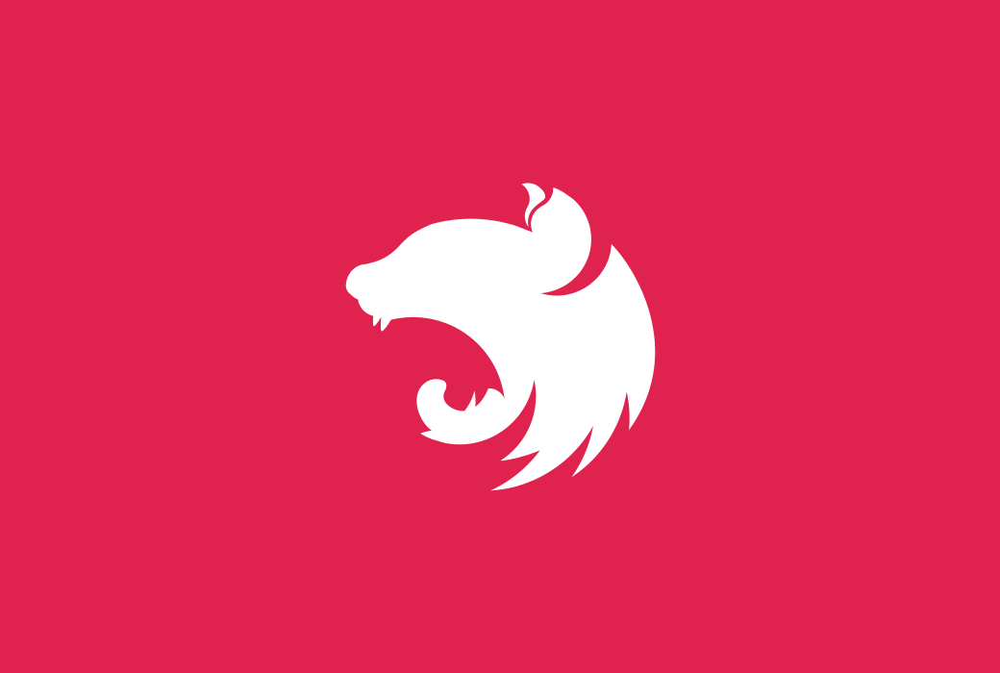

  <h1>NESTJS: PROGRAMACION BACKEND</h1>
  
  <h3 style="font-weight:bold;" >Nest.js: Programacion Beckend (5H)</h3>
 

  
A progressive <a href="http://nodejs.org" target="_blank">Node.js</a> framework for building efficient and scalable server-side applications.

    

## Requisitos :clipboard:

* Conocimiento básico de JavaScript es necesario
* Conocimiento básico de programación es necesario
* Conocimiento básico de Typescript es necesario
* Conocimiento básico de ECMAscript 6 || ES2015
* Poder realizar instalaciones en el equipo como administrador
* Se puede lanzar el contenido del curso en OSX (Mac), Windows o Linux.
* Conocimiento verbos http requerido.
* Conocimiento de Git necesario.
* **Nota :** prework usado **WebStorm**

## Comenzando 🚀

 * Este curso se guardara en github y los ejemplos sin llaves privadas y configuradas en ficheros .env con ejemplos en example.env limpio que puedan ser usadas para desplegar en otros servidores locales o remotos.

* En todo el proyecto se usaran objetos exportables y seran llamados en fichero de './config/index.js' refiriendose al procces.env para estructurar una logica comprensible y ordenada de datos privados.
* Las api utilizas en servicios seran modificadas al finalizar las secciones. 👌

## Descripción :notebook:
**Aprender Nest.js 2022**
* Este curso tiene por objetivo tener conocimientos de Nestjs hasta un nivel basico o intermedio.
* Este curso está construido 100% en js || ts,  funcional , interfaces, contructors u/o clases.

## Listado de Temas del Curso: 💯

    *   Sc01 - Introduccion: Que es nestjs
    *   Sc02 - Introduccion: Crear primer proyecto nestjs
    *   Sc03 - Introduccion: Estructura de proyecto nestjs
    *   Sc04 - Introduccion: Presentacion de proyecto
    *   Sc05 - Introduccion: Repaso tipado con ts : tipos & Poo
    *   Sc06 - Rest Api: Controladores
    *   Sc07 - Rest Api: Verbo GET - Recibir params
    *   Sc08 - Rest Api: Verbo GET - Recibir query params
    *   Sc09 - Rest Api: Verbo GET - Separar resposabilidades
    *   Sc10 - Rest Api: config postman & insomnia
    *   Sc11 - Rest Api: Verbo POST - Method create
    *   Sc12 - Rest Api: Verbo PUT & DELETE - Method edith & delete
    *   Sc13 - Rest Api: Status Code HTTP
    *   Sc14 - Integridad de Datos: Introduccion a servicios.
    *   Sc15 - Integridad de Datos: Implementacion de services in controller
    *   Sc16 - Integridad de Datos: Manejo de errores
    *   Sc17 - Integridad de Datos: Introduccion a pipes personalizados
    *   Sc18 - Integridad de Datos: Creacion de pipes
    *   Sc19 - Integridad de Datos: Validacion de Datos
    *   Sc20 - Integridad de Datos: Evitar envio de datos incorrectos
    *   Sc21 - Reto: crear - controllers and services :{ Products , Categories , Brands , users , Customers }

